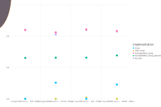

The style follows the official [Julia Micro-Benchmarks](https://julialang.org/benchmarks/).

[](./example.svg)


```julia
using Benchmarkplotting
using Gadfly
using Statistics

cases = [
    :range100   => 1:100,
    :range10000 => 1:10000,
    :array100   => [(1:100)...],
    :array10000 => [(1:10000)...],
    :ice1000    => (1 for _ in 1000)
]

implementations = [
    :map       =>
        function (x)
            map(e -> e + 1, x)
        end,
    :list_comp =>
        function (x)
            [e + 1 for e in x]
        end,
    :handwritten_loop =>
        function(x)
            i = 0
            arr = []
            while (iter = iterate(x, i); iter !== nothing)
                e, i = iter
                push!(arr, e + 1)
            end
            arr
        end,
    :for_iter =>
        function(x)
            arr = []
            for e in x
                push!(arr, e + 1)
            end
            arr
        end
]


criterion(benchmark_result) = (time = mean(benchmark_result.times), )

df = bcompare(criterion, cases, implementations)
res = report(:time, df)
@info res[2]
draw(SVG("example.svg", 9inch, 7inch), res[1])

```
